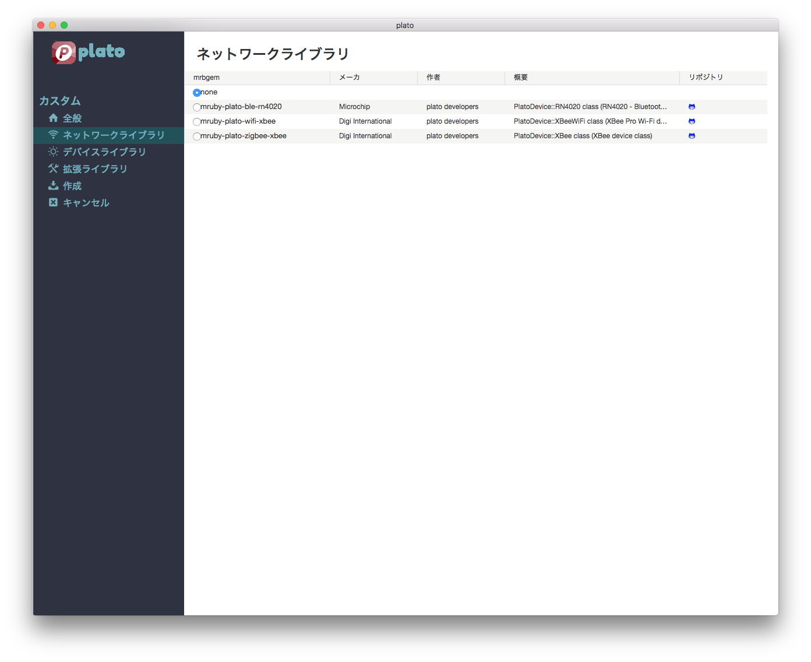

# カスタムモード

Plato IDEのカスタムモードでは、使用するライブラリ等を細かく指定して、mrubyアプリケーションの雛形を作成することができます。

# 1. アプリケーション情報の入力

Plato IDEを起動し、カスタムモードを選択すると、**全般**画面が表示されます。  
この画面では、作成するアプリケーションの基本情報を指定します。


## アプリケーション名  

作成するアプリケーションの名称(英数字)を入力します。  
入力したアプリケーション名はアプリケーションのディレクトリ名として使用されます。

### 注意点  

- 指定した名称のアプリケーション名が既に存在する場合には、新たに作成するアプリケーションの内容で既存のアプリケーションが上書きされます。
- ディレクトリ名に使用できない文字( \ / : * ? " < > \| )は指定できません。
- Windows環境では大文字/小文字が区別されません。


## ターゲットボード  

アプリケーションを動作させるターゲットボード(マイコンボード)を指定します。

### なし

マイコンボードを使用しません。  
PC上でのシミュレーション動作のみ使用可能です。


### enzi

[enzi](http://enzi.cc)ボードを使用します。

### Raspberry Pi

[Raspberry Pi](https://www.raspberrypi.org)ボードを使用します。

### GR-PEACH

[GR-PEACH](http://gadget.renesas.com/ja/product/peach.html)ボードを使用します。

### QSIP  

[QSIP](http://www.fujitsu.com/jp/group/qnet/services/qsip/)
ボードを使用します。


## オプションボード  

ターゲットボードに接続して使用するオプションボードを指定します。  


### なし

オプションボードを使用しません。


### White-Tiger

White-Tigerセンサボードを使用します。  
White-TigerセンサボードはArduino互換PIN配置のマイコンボードで使用できます。


## <a name="app-type">アプリケーションタイプ</a>  

作成するアプリケーション種別を指定します。  


### mruby組込みアプリケーション  

標準的な組込みアプリケーションの雛形を作成します。
```Ruby
# mruby embedded application
include Plato

class MyApplication < MrubyApplication
  SENSING_PERIOD = 10000  # ms
  def initialize
    super
    # setup devices
    # 

    # setup timer handlers
    add_timer(SENSING_PERIOD, Proc.new {|app| app.sensing})
  end

  def sensing
    # read/analize sensor values
  end

  def _loop
    # background process
  end
end
MyApplication.new.start
```

MRubyApplicationクラスを使用したmruby組込みアプリケーションの雛形が作成されます。

- MyApplication#initializeメソッド  
アプリケーション初期化時に呼び出されます。  
アプリケーション起動時に一度だけ実行が必要なデバイスの初期化処理などを追加します。  
デフォルトでは、10秒周期のタイマハンドラの登録処理が追加されます。

- MyApplication#sensingメソッド  
周期起動されるタイマハンドラ処理を記述します。起動周期の変更は定数 **SENSING_PERIOD** の値を変更することで可能です。**SENSING_PERIOD** の値はミリ秒単位で指定します。

- MyApplication#_loopメソッド  
およそ1ms周期で繰り返し実行されるメソッドです。バックグランドで実行したい処理等を記述します。  
MRubyApplicationクラスのアプリケーション実行時は、_loopメソッド終了後にタイマハンドラの実行周期判定が行われるため、**_loop**メソッドの処理で時間がかかる処理を実行した場合には、タイマハンドラの実行タイミングが遅延する可能性があります。

### Arduinoスタイルアプリケーション  

Arduinoスタイルの組込みアプリケーションの雛形を作成します。
```Ruby
# Arduino style application
include Plato

class MyApplication < MrubyApplication
  def _setup
    # setup devices
    # 
  end

  def _loop
    # background process
  end
end
app = MyApplication.new
app._setup
app.start
```

Arduinoの **setup**関数 および **loop**関数 に相当する **\_setup** / **\_loop** メソッドに処理を記述することで、スタート時の初期化処理と繰り返し処理を実現できます。
**\_setup**メソッドは起動時のみ、**\_loop**メソッドは(およそ))1ms周期で起動されます。

### 空のアプリケーション  

空のアプリケーションを作成します。

### 組込み向けmrubyライブラリ  

準備中です。

### 標準的なmrubyライブラリ  

準備中です。


# 2. ネットワークライブラリの選択  

画面左の **ネットワークライブラリ** を選択すると、**「ネットワークライブラリ」** 画面が表示されます。



ここでは、アプリケーションで使用するネットワークデバイスが選択できます。


# 3. デバイスライブラリの選択  

画面左の **デバイスライブラリ** を選択すると、**デバイスライブラリ** 画面が表示されます。


ここでは、アプリケーションで使用するデバイスライブラリが選択できます。


# 4. 拡張ライブラリの選択

画面左の **拡張ライブラリ** を選択すると、**拡張ライブラリ** 画面が表示されます。


ここでは、アプリケーションで使用する拡張ライブラリが選択できます。


# 5. 作成

入力した内容で、アプリケーションの雛形を自動生成します。  
Visual Studio Codeが起動され、生成されたPlatoアプリケーションが表示されます。
