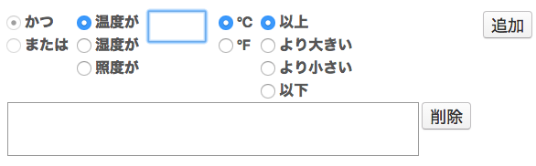

# シンプルモード

Plato IDEのシンプルモードでは、ウィザード形式の簡単な手順でmruby組込みアプリケーションを作成することができます。  

# 1. アプリケーション情報の入力

Plato IDEを起動し、シンプルモードを選択すると、**アプリケーション情報の入力**画面が表示されます。  
この画面では、作成するアプリケーションの基本情報を指定します。

## アプリケーション名  

作成するアプリケーションの名称(英数字)を入力します。  
入力したアプリケーション名はアプリケーションのディレクトリ名として使用されます。

### 注意点  

- 指定した名称のアプリケーション名が既に存在する場合には、新たに作成するアプリケーションの内容で既存のアプリケーションが上書きされます。
- ディレクトリ名に使用できない文字( \ / : * ? " < > \| )は指定できません。
- Windows環境では大文字/小文字が区別されません。

## ターゲットボード  

アプリケーションを動作させるターゲットボード(マイコンボード)を指定します。

### なし

マイコンボードを使用しません。  
PC上でのシミュレーション動作のみ使用可能です。

### enzi

[enzi](http://enzi.cc)ボードを使用します。

### Raspberry Pi

[Raspberry Pi](https://www.raspberrypi.org)ボードを使用します。

### GR-PEACH

[GR-PEACH](http://gadget.renesas.com/ja/product/peach.html)ボードを使用します。

### QSIP  

[QSIP](http://www.fujitsu.com/jp/group/qnet/services/qsip/)
ボードを使用します。

## オプションボード  

ターゲットボードに接続して使用するオプションボードを指定します。  

### なし

オプションボードを使用しません。

### White-Tiger

White-Tigerセンサボードを使用します。  
White-TigerセンサボードはArduino互換PIN配置のマイコンボードで使用できます。

## <a name="app-type">アプリケーションタイプ</a>  

作成するアプリケーション種別を指定します。  

### センサ値をトリガにデータを処理する

定期的に各種センサからデータを取得し、その値が指定の条件を満たした場合に何らかの処理を行うアプリケーションを生成します。

### サーバにデータを送信する

各種センサから取得したデータを定期的にサーバに送信するクライアントアプリケーションを作成します。

## <a name="network-device">ネットワークデバイス</a>  

使用するネットワークデバイスを指定します。

### なし

ネットワークデバイスを使用しません。  
アプリケーション内で通信機能を使用しない場合に選択して下さい。

### WiFi

WiFiネットワークを使用した通信機能を使用します。  
WiFiアクセスポイントへの接続機能およびTCP/IP通信機能が利用できます。

### BLE

BLE(Bluetooth Low Energy)を使用した通信機能を使用します。  

### ZigBee

ZigBeeを使用した通信機能を使用します。

### Ethernet

Ethernetを使用した通信機能を使用します。
TCP/IP、UDP/IP通信機能が利用できます。

## Next

次の画面に遷移します。  
[アプリケーションタイプ](#app-type)で選択した内容によって遷移先の画面が異なります。

----

# センサ値をトリガにデータを処理する

[アプリケーションタイプ](#app-type)で**センサ値をトリガにデータを処理する**を選択して**Next**をクリックした場合に表示される画面です。  
定期的に各種センサからデータを取得し、その値が指定の条件を満たした場合に処理を行うアプリケーションを生成するための設定を行います。

## ○秒周期でセンサ値を取得する

各種センサからの値読み取り周期（間隔）を秒単位で指定します。  
指定された間隔で、各種センサから値読み込み、値読み込み後のトリガ条件判定が行われます。
0以下の値は指定できません。

## トリガ条件

センサから読み込んだ温度、湿度、照度の値をもとに、トリガ（処理実行のきっかけ）となる条件を指定します。  
1件以上のトリガ条件を指定する必要があります。

### かつ／または

複数のトリガ条件を登録する場合に、登録する条件と登録済みの条件の関係を指定します。  
**「かつ」**を選択した場合は、登録する条件と登録済みの条件の両方が成立する場合にトリガ条件が成立します。
**「または」**を選択した場合は、登録する条件と登録済みの条件のいずれかが成立した場合にトリガ条件が成立します。  
3つ以上の条件を登録した場合は、1件目から順にトリガ条件が判定されます。

### 温度／湿度／照度

温度(℃ または ℉)、湿度(%)、照度(lux)でトリガ条件の基準となる値を指定します。

### 以上／より大きい／より小さい／以下

基準値と比較してセンサ読み取り値がどうだった場合にトリガ条件が成立するかを指定します。

- 以上  
  **センサ読み取り値 ≧ 基準値** の場合にトリガ条件が成立します。

- より大きい  
  **センサ読み取り値 ＞ 基準値** の場合にトリガ条件が成立します。

- より小さい  
  **センサ読み取り値 ＜ 基準値** の場合にトリガ条件が成立します。

- 以下  
  **センサ読み取り値 ≦ 基準値** の場合にトリガ条件が成立します。

### 追加

入力したトリガ条件をトリガ条件に登録します。  
登録済みのトリガ条件がある場合は、最後の条件として追加されます。登録されたトリガ条件は、条件リスト欄に表示されます。

### 削除

条件リスト欄で選択しているトリガ条件1件を削除します。

## 上記が発生したときに／上記の状態が継続中の間○分毎に

指定したトリガ条件が成立した時点のみに処理を行うか、トリガ条件が成立した時点および一定時間継続した場合に処理を行うかを指定します。  

### 上記が発生したときに

指定したトリガ条件が成立した時点で処理を行います。
トリガ条件成立後、条件が成立している間は処理が行われませんが、トリガ条件不成立となった後に再度条件が成立すれば、トリガ条件が成立した時点で処理が行われます。

### 上記の状態が継続中の間○分毎に

指定したトリガ条件が成立した時点およびトリガ条件成立中の状態が指定の時間以上連続した場合に処理を行います。  
トリガ条件成立中の状態が何分続いたら処理を行うかを指定します。

## アクション

トリガ条件が成立した際のアクション(実行内容)を指定します。

### <a name="action-ifttt">IFTTTに通知する</a>

IoTサービスの[IFTTT](https://ifttt.com/)に通知します。  
IFTTTが提供する[Maker channel](https://ifttt.com/maker)に対応したデータ形式で各種センサから読み込んだ値を通知することができます。

- Event  
  通知するMacker channelの Event Name を指定します。

- Key  
  Maker channelに接続するために必要な Secret key を指定します。  
  Secret key は [IFTTT](https://ifttt.com/)にSign Inして、[Maker - setting](https://ifttt.com/services/maker/settings)の**Account Info**欄に記載されているURLにアクセスすることで参照できます。

IFTTTのMaker channelの作成およびそれを使用したレシピの作成例については[こちら](ifttt-sample.html)を参照して下さい。

### サーバへデータを送信する

[ネットワークデバイス](#network-device)で指定した通信経路を使用して、JSON形式で整形したセンサ読み取り値をサーバに送信します。

- 送信先  
  送信先(サーバ)のホスト名またはアドレスを指定します。

- ポート  
  送信先のポート番号を指定します。

### 選んだポートをONする

マイコンボードのIOポートに値を出力します。  
また、出力先のポートがONとなる値を指定します。

- ポート  
  出力対象のポートを指定します。指定できる内容はマイコンボードに依存します。

- ON値  
  トリガ条件が成立した時に出力する値(LOWまたはHIGH)を指定します。

- 発生しなくなったら○○○に戻す  
  トリガ条件が成立しなくなった時にOFF値(ON値と逆の値)を出力するかどうかを指定します。

### やりたいことを入力

トリガ条件が成立した時に実行する処理内容をユーザが記述したい場合に、メモや処理概要等を記載します。  
この欄に入力した内容は、生成されるアプリケーションのソースコードにコメントとして出力されます。(コメント行のため処理は行われません)

## Create

入力した内容で **センサ値をトリガにデータを処理する** アプリケーションを自動生成します。  
Visual Studio Codeが起動され、生成されたPlatoアプリケーションが表示されます。

----

# サーバにデータを送信する

[アプリケーションタイプ](#app-type)で**サーバにデータを送信する**を選択して**Next**をクリックした場合に表示される画面です。
センサから取得した値を定期的にサーバへ送信するアプリケーションを生成するための設定を行います。

## ○秒周期でセンサ値を取得する  

各種センサからの値読み取り周期（間隔）を秒単位で指定します。  
指定された間隔で、各種センサから値読み込みが行われ、サーバまで蓄積されます。
1未満の値は指定できません。

## ○分周期でデータを送信する

各種センサから周期的に読み取って蓄積したデータをサーバへ送信する周期を分単位で指定します。  
データ送信後は蓄積されているセンサ読み取り値がクリアされます。
1未満の値は指定できません。

## 温度／湿度／照度／日時  

サーバへ送信するデータを選択します。  
温度(℃ または ℉)、湿度(%)、照度(lux)、日時(年-月-日 時:分:秒)が選択できます。

## の値／の平均値／の最小値／の最大値  

- の値  
最新のセンサ値が送信データとして使用されます。

- の平均値  
前回送信後から送信時までに蓄積されてたセンサ値の平均値が送信データとして使用されます。  

- の最小値  
前回送信後から送信時までに蓄積されてたセンサ値の最小値が送信データとして使用されます。  

- の最大値  
前回送信後から送信時までに蓄積されてたセンサ値の最大値が送信データとして使用されます。  

日時を選択した場合は送信時点のマイコンボードの日時が設定されます。

## アクション

データ送信のアクション(実行内容)を指定します。

### IFTTTに通知する

IoTサービスの[IFTTT](https://ifttt.com/)に通知します。  
設定内容は [センサ値をトリガにデータを処理する](#action-ifttt) の場合と同様です。

### MAGELLAN BLOCKSに通知する

IoTサービスの[MAGELLAN BLOCKS](https://www.magellanic-clouds.com/blocks/)に通知します。  
IoTボード(メッセージ受信タイプ)に登録したデータを設定することでMAGELLAN BLOCKSとのデータ連係が可能です。

- エントリーポイント  
IoTボードのエントリーポイントを指定します。

- プロジェクトID  
GCP(Google Cloud Platform)のプロジェクトIDを指定します。

- APIトークン  
APIトークンを指定します。

- メッセージタイプ  
データ格納先のストレージを識別するためのメッセージタイプを指定します。

- 識別ID  
任意に指定可能な付加情報です。

IoTボード(メッセージ受信タイプ)の登録については[こちら](https://www.magellanic-clouds.com/blocks/iot-guide-message/)を参照して下さい。

### サーバへデータを送信する

[ネットワークデバイス](#network-device)で指定した通信経路を使用して、JSON形式で整形したセンサ読み取り値をサーバに送信します。

- 送信先  
  送信先(サーバ)のホスト名またはアドレスを指定します。

- ポート  
  送信先のポート番号を指定します。

### やりたいことを入力

データ送信時に実行する処理内容をユーザが記述したい場合に、メモや処理概要等を記載します。  
この欄に入力した内容は、生成されるアプリケーションのソースコードにコメントとして出力されます。

## Create

入力した内容で **サーバにデータを送信する** アプリケーションを自動生成します。  
Visual Studio Codeが起動され、自動生成されたPlatoアプリケーションが表示されます。
