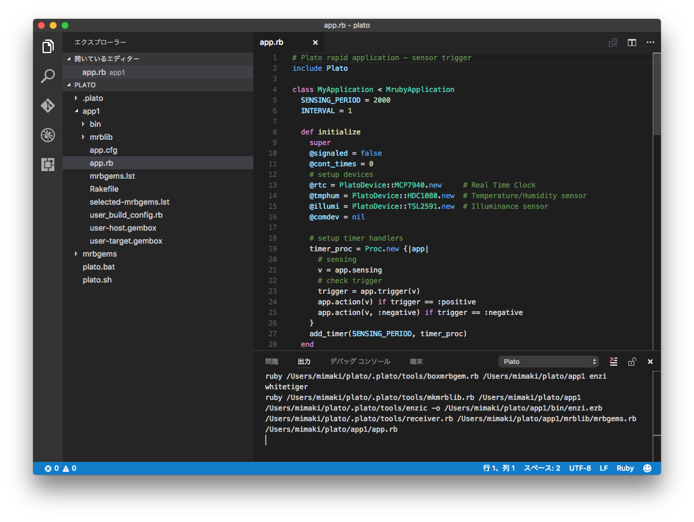

# プログラムの実行

Plato IDEの**シンプル**モードでアプリケーションを作成すると、**Visual Studio**が起動され、生成されたアプリケーションのソースコード **app.rb** が表示されます。


## 1. ソースコードの編集(必要な場合のみ)  
必要に応じてアプリケーションのソースコード(app.rb)を編集します。  

ここでは温度センサから取得した値をターミナルソフトに表示させるように変更してみます。

センサからの値取得はsensingメソッドで行われます。  
下記の31行目で温湿度センサ(HDC1080)から読み込んだ温度、湿度の値がそれぞれtm, huに格納されるので、32行目にtmを表示するコードを追加してみます。

### 変更前
```ruby
30  def sensing
31    tm, hu = @tmphum.read
32    il = @illumi.read
33    [tm, hu, il]
34  end
```
### 変更後 (32行目を追加)
```ruby
30  def sensing
31    tm, hu = @tmphum.read
32    puts tm
33    il = @illumi.read
34    [tm, hu, il]
35  end
```

変更後、**ファイル - 保存** をクリックし、app.rb を保存します。

## 2. アプリケーションのコンパイル  

アプリケーション(app.rb)をコンパイルするには、Visual Studio Codeでapp.rbを開いている状態で Ctrl+F6 (Macの場合は ⌘+F6) を入力します。



app.rbのソースコード表示の下に **Plato** ペインが表示され、左の**エクスプローラー**ペインの app1/bin に **enzi.ezb** が作成されていればコンパイルが完了しています。

## 3. アプリケーションの実行

1. コンパイル結果(enzi.ezb)をmicroSDカードのルートディレクトリにコピーします。
2. microSDカードをenziボードに装着します。
3. ターミナルソフト(CoolTerm)を起動します。
4. enziボードとPCをUSBケーブルで接続します。(enziボードの電源が入ります)
5. CoolTermの**Option**をクリックします。
6. Portを選択してOKをクリックします。  
Windowsの場合: "COMx"  
Macの場合: "usbmodemXXXX"  
7. enziのリセットボタン(enziボードの赤色LEDが点灯している側のボタン)を1回押します。
8. CoolTermの**Connect**をクリックします。  
enziの起動表示後、2秒周期で温度が表示されます。

White-Tigerボードの温湿度センサ(**TEMP SENSOR**と印刷されている部分の上部にある正方形の黒い部品)を指で触れると温度を上げることが出来ます。30度以上になったらWhite-TigerのST0(緑LED)が点灯する動作が確認できます。
