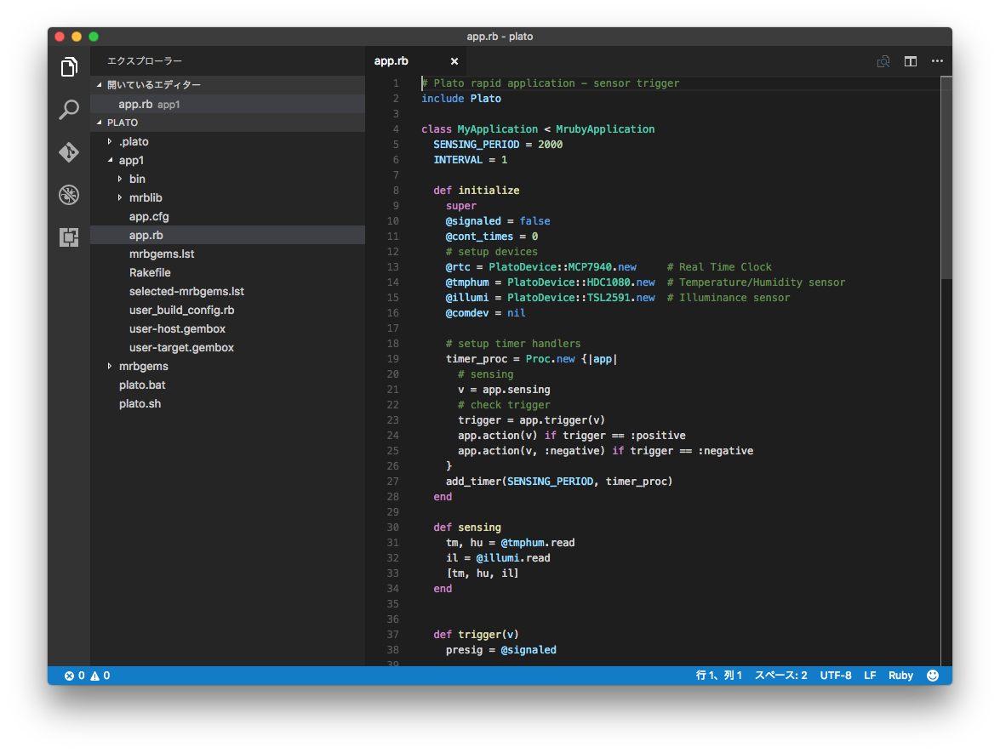

# Plato IDEの実行

Plato IDEの起動からIoTアプリケーションを作成するまでの流れを以下に示します。  
ここでは、以下のアプリケーションを生成する手順を示します。  

```
「気温が30度以上になった場合にLEDを点灯する」

使用するマイコンボード: enzi, White-Tiger
```

## 1. Plato IDEの起動

- Windowsの場合  
デスクトップにある Plato IDE のアイコンをダブルクリックします。

- Macの場合  
Launchpadにある Plato IDE のアイコンをクリックします。

## 2. アプリケーション種別選択  
作成するアプリケーションの種別を選択します。


- シンプル  
GUIの項目を入力するだけで簡単にIoTアプリケーションが作成できます。  

- カスタム  
使用するライブラリ、作成するアプリケーション種別を詳細に設定して、アプリケーションの雛形を作成します。  

ここでは、**シンプル**を選択します。

## 3. アプリケーション情報の入力  

**アプリケーションの新規作成**画面より以下の項目を入力して、**Next**をクリックします。

|項目|入力内容|
|:--|:--|
|アプリケーション名|app1|
|ターゲットボード|enzi|
|オプションボード|White-Tiger|
|アプリケーションタイプ|センサ値をトリガにデータを処理する|
|ネットワークデバイス|なし|


## 4. アプリケーション情報の入力(つづき)

**センサ値をトリガにデータを処理する**画面より、以下の項目を入力して、**Create**をクリックします。

|項目|入力内容|備考|
|:--|:--|:--|
|XX秒周期でセンサ値を取得する|2||
|温度が|30℃以上|追加ボタンをクリックします|
|上記が発生したときに|チェックON||
|選択したポートをONする|チェックON||
|ポート|ST0||
|ON値|LOW||
|発生しなくなったらHIGHに戻す|チェックON|


**Visual Studio**が起動され、生成されたアプリケーションのソースコード **app1/app.rb** が表示されます。


